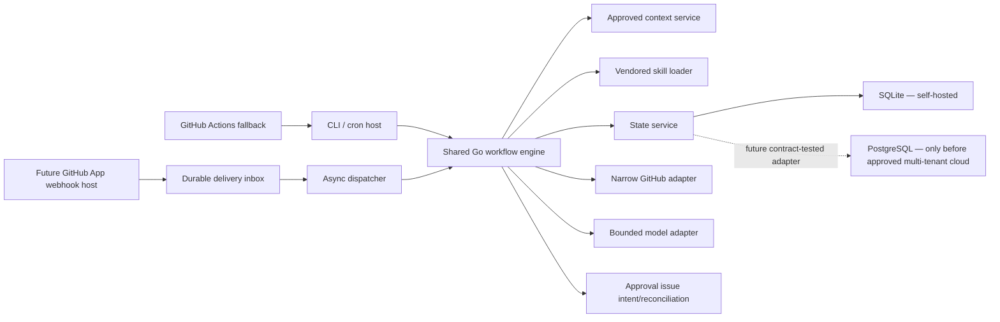

# Shared-Core Architecture

## Scope and status

This document separates implemented behavior from the ratified target.

- **Implemented now:** Go modular monolith, Cobra CLI, cron scheduler, SQLite, bounded model/skills runtime, and idempotent GitHub approval issues.
- **Target seam:** a thin Go HTTP/webhook host for a future GitHub App, specified in [`GITHUB_APP_IMPLEMENTATION_PLAN.md`](GITHUB_APP_IMPLEMENTATION_PLAN.md).
- **Not authorized here:** App registration, credentials, deployment, cloud selection, PostgreSQL implementation, dashboard, Marketplace, or multi-tenancy.

The target is one engine with two hosts, not two products.

## Existing contracts to preserve

The implementation already exposes the useful shared boundary:

```go
Run(context.Context, string, workflows.RunOptions) (workflows.RunOutcome, error)
```

`internal/workflows/release.go` implements it on `ReleaseWorkflow`; `internal/scheduler/scheduler.go` depends on the same signature through `scheduler.Runner`. `RunOptions` already carries `TriggerType`, `ReleaseID`, and `DryRun`. The CLI wiring in `internal/app/runtime.go` constructs the workflow service.

Other existing boundaries:

- `internal/productcontext.Service.Draft` and `.Approve` own context onboarding.
- `internal/skills.Loader` owns `Index`, `Load`, `Status`, `RequirePinned`, and manifest computation. After vendoring, normal runtime `status` and `list` remain available while runtime `skills update` must fail closed with maintainer guidance.
- `internal/workflows.GitHubAPI` exposes only repository/release/file reads plus marker search and approval-issue creation.
- `internal/state` owns SQLite transactions, claims, fencing, dedupe, cursors, approvals, and audit.
- `internal/products.Workspace` owns contained atomic product files.

These contracts are evidence, not permission to widen capabilities.

## Target component model



### Host boundary

Hosts may authenticate input, normalize a trigger, select a product/workflow, invoke the engine, and render a result. Hosts must not implement evidence selection, prompts, validation, state transitions, retry semantics, approval rendering, or external marketing actions.

The future HTTP host must call the Go service in-process. It must not shell out to the CLI.

### `release.published` target flow

After a separately approved GitHub App implementation begins:

1. Receive the raw request under strict body-size and timeout limits.
2. Verify the GitHub webhook signature before parsing or acknowledging work.
3. Accept only the configured event and the `published` release action; reject/ignore every other event fail-closed.
4. Extract immutable delivery, installation, repository, and release identifiers. The future App requires the immutable repository ID sourced from authenticated GitHub data; the current CLI's repository ID remains optional.
5. Persist a separate delivery-ID-deduplicated record before returning success. Retain only the delivery ID, payload hash, installation/repository/release IDs, event/action, receipt time, disposition, allowlisted reason code, and—only for dispatchable work—bounded queue/lease/attempt fields. Do not retain a raw body, signature, credential, free-form diagnostic, or arbitrary payload field.
6. Return promptly; process asynchronously with bounded retries and observable terminal failure.
7. Resolve the installation/repository to an existing product whose context is approved and workflow is enabled. If any readiness precondition fails, mark the delivery `blocked_precondition`, make no model or approval-issue call, and stop.
8. Obtain a narrowly scoped installation token at runtime; never persist or log the token.
9. Invoke the existing release service with the immutable release ID and an explicit webhook trigger type.
10. Let the existing workflow own evidence, model calls, validation, dedupe, approval intent, marker reconciliation, and `awaiting_approval`.

The implementation-level HTTP, signature, lifecycle, delivery, permission, token, retry, privacy, and test contracts are normative in [`GITHUB_APP_IMPLEMENTATION_PLAN.md`](GITHUB_APP_IMPLEMENTATION_PLAN.md).

GitHub delivery dedupe protects transport ingestion. The existing release dedupe protects business execution. Both are required. A blocked delivery is never replayed automatically after approval or enablement. Any retry is an explicit operator action that reuses the recorded immutable release ID—not a lookup of the latest release—and passes every current precondition and release dedupe check again.

### Context-first App installation

Installation does not enable release generation. It establishes repository identity from the authenticated installation, requires the immutable repository ID for App-created products, creates or selects a disabled product/workflow, then routes to the draft/review/approve flow in [`ONBOARDING.md`](ONBOARDING.md). A release event received before readiness uses the minimal deduped `blocked_precondition` record described above; it must not call the model, create an issue, or auto-replay.

### Storage

SQLite remains the self-hosted store. Its current WAL, claim, fencing, dedupe, cursor, approval-intent, and audit semantics are normative (`docs/database.md`).

A PostgreSQL seam is a future prerequisite for managed multi-tenancy, not a current deliverable. It must be introduced at the service/store boundary with shared contract tests. Ad-hoc SQL substitution inside workflows is prohibited. No cloud host has been selected.

### GitHub Actions fallback

The existing reusable Action may invoke the CLI for power users/self-hosted runners. It must not encode a separate workflow, weaken context/skills verification, or gain publishing behavior. Repository CI now lives at `.github/workflows/ci.yml` and verifies the project; it is not product trigger logic. CI requirements remain in [`TESTING_AND_RELEASE.md`](TESTING_AND_RELEASE.md).

## Reliability and failure rules

- Acknowledged webhook deliveries must be durable before asynchronous processing.
- A pre-deployment App-delivery monitor and bounded listing/redelivery runbook or reconciler must recover transient ingress failures that were never acknowledged or persisted; internal retries cannot recover absent rows.
- Delivery and release identities must be immutable provider IDs, not tag names or titles.
- Delivery records contain only the minimal authenticated metadata needed for conflict-safe dedupe, disposition, bounded queue leasing, and explicit retry. Terminal pre-readiness rows do not acquire queue/lease/attempt data. A retention/deletion policy requires privacy and operations review before deployment; tests must not silently establish that policy.
- Retries must be bounded, cancellable, and observable.
- An expired/revoked installation, deleted repository, missing mapping, disabled workflow, invalid skills manifest, unapproved context, or kill switch blocks processing.
- A readiness-blocked delivery records the bounded precondition failure, performs no model/issue call, and is never automatically replayed after state changes.
- Network calls must never occur inside a database transaction.
- A worker may not finalize after losing its fencing token.
- Dedupe completes and cursors advance only on successful `no_action` or reconciled `awaiting_approval`.
- Approval issue creation retains write-ahead intent and deterministic marker recovery.
- There is no automatic dead-letter replay that bypasses operator review.

## Implementation seams and gates

| Seam | Current evidence | Gate before future App code |
|---|---|---|
| Shared workflow call | `internal/workflows/release.go`, `internal/scheduler/scheduler.go` | CLI, scheduler, and webhook-host tests use the same runner |
| Product/repository identity | Current CLI accepts an optional repository ID | App-created products require immutable repository ID and name sourced from authenticated installation data |
| Product context | `internal/productcontext/service.go` | App onboarding cannot enable/run before explicit approval |
| GitHub access | `internal/github/client.go`, `workflows.GitHubAPI` | Installation auth is narrow, runtime-only, redacted |
| Durable trigger inbox | Not implemented | Implement the schema, state machine, and tests in [`GITHUB_APP_IMPLEMENTATION_PLAN.md`](GITHUB_APP_IMPLEMENTATION_PLAN.md); approve retention before deployment |
| Store abstraction | SQLite implementation in `internal/state` | Shared contract suite exists before PostgreSQL |
| Web UI/auth | Not implemented | Owner approves scope; Q-AUTH-1/Q-DASHBOARD-1 defaults remain provisional |

## Architecture anti-patterns

Do not:

- duplicate workflow behavior in the CLI, HTTP handler, worker, or YAML;
- let webhook payloads choose arbitrary products, workflows, repositories, or output destinations;
- call a generic arbitrary-write GitHub client;
- treat webhook acknowledgement as workflow completion;
- use SQLite for an unapproved multi-tenant service;
- create App keys, cloud resources, or deployment configuration in this phase;
- ingest human approval as permission to publish;
- weaken the existing validator, manifest, path, size, lease, dedupe, or reconciliation rules.

## Acceptance

The architecture is implemented correctly only when both current hosts still pass their tests, a future host can invoke the same in-process runner without new workflow semantics, context and skills preflights run before model/external writes, replays converge without duplicate issues, and forbidden execution capabilities remain absent.
