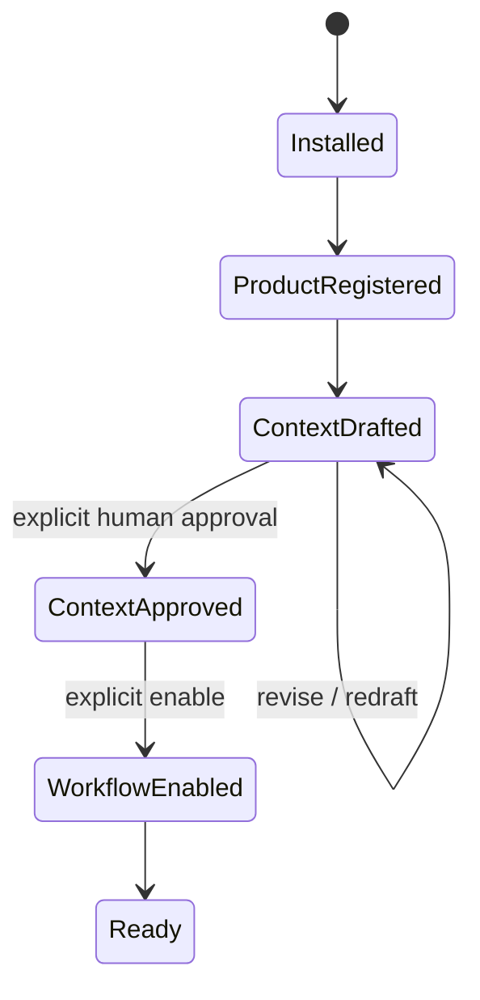

# Context-First Onboarding

## First success

The first success moment is not generated release copy. It is a product-context draft that the user recognizes as evidence-grounded, with unsupported facts visibly marked, followed by explicit human approval. This is D-007's binding product gate.

The current CLI flow in `GUIDE.md` and `internal/productcontext/service.go` is the reference behavior. A future GitHub App may simplify the host experience but must use the same context service and approval semantics.

## Required state progression

Installation, repository access, context drafting, context approval, and workflow enablement are distinct actions. None implies the next.

## Shared onboarding contract

### 1. Establish product identity

- Current registration requires a product ID, product name, product type, primary conversion action, and default language. The CLI defaults `--language` to `en`, but the stored domain field must be nonblank.
- Repository name, repository ID, local repository, website, documentation, pricing, and changelog locations are optional source configuration. Repository name is required later if the release workflow will run.
- The current CLI accepts an optional GitHub repository ID and recommends it for rename/replacement detection; it does not derive or require that ID during registration.
- Create an isolated product workspace and a complete but disabled `release-to-marketing` definition.
- Store environment-variable names, never credential values.

CLI evidence: `product add` in `GUIDE.md`, `docs/cli.md`, and `internal/domain/product.go`. Any derivation or defaulting beyond the current CLI behavior is future work. A future App-created registration must require the immutable repository ID and derive it, the current `owner/repo`, and installation identity from authenticated GitHub installation data rather than trusting caller-supplied request fields.

### 2. Verify prerequisites

- Vendored skills must pass `RequirePinned`.
- The source repository and configured URLs must pass existing path/URL/size policies.
- A model credential is read only at runtime for BYOK operation.
- Missing evidence or unsafe config blocks drafting with an actionable error.

### 3. Draft context

Use `product-marketing` and bounded evidence from product metadata, allowlisted repository docs, and explicitly configured HTTPS sources. Preserve immutable evidence IDs and source warnings. The model returns strict structured output; deterministic code validates required sections and same-product evidence.

Every unsupported field must remain explicit, using the existing unknown/uncertain convention. Do not fill gaps from model memory.

### 4. Review

Show:

- the complete draft;
- source/evidence references;
- unsupported or uncertain claims;
- source failures/warnings;
- pinned skill commit/manifest metadata;
- the fact that approval satisfies one workflow precondition but does not enable the workflow or publish anything.

The review surface may be CLI/files today and a GitHub/server-rendered view later. Presentation must not change state semantics.

### 5. Approve explicitly

The current CLI requires an exact context version and a nonblank caller-provided actor (from `--actor` or its environment-derived default). It records the provided actor and approval time/history, but does not authenticate that identity. A future GitHub App must bind approval to an authenticated GitHub actor. Approval supersedes any prior canonical context; draft creation never calls approval automatically.

### 6. Enable explicitly

The release workflow remains disabled after context approval until an operator enables it. Current `ReleaseWorkflow.Run` checks workflow enablement before all later preconditions, including in dry-run mode, so the current sequence is approve, enable, then dry-run. Dry run should be the recommended next action after enablement and must retain its current no-workflow-domain-write/no-issue behavior.

Current context approval records the caller-provided actor and time. Current `SetWorkflowEnabled` only updates the workflow row and does not append a separate enablement audit event. A future host must add a distinct enable/disable audit record with authenticated actor, timestamp, product, workflow, and old/new state before claiming that enablement is separately audited.

## Future GitHub App behavior

The App installation flow should:

1. explain repository permissions and the single approval-issue write capability;
2. create/select a product in disabled state using the immutable repository ID and current repository name sourced from authenticated GitHub installation data;
3. generate a draft only after the user initiates or confirms source collection;
4. route to review with uncertainties prominent;
5. require explicit context approval from an authenticated GitHub actor;
6. require explicit workflow enablement;
7. then report readiness for future `release.published` events.

Q-AUTH-1, Q-MODEL-1, and Q-DASHBOARD-1 remain OPEN. Their fail-closed defaults are GitHub-only authentication, BYOK, and—only if a UI is approved—Go server-rendered HTML/HTMX. This blueprint does not authorize a dashboard or App deployment.

### Pre-readiness webhook disposition

A future App may receive an authenticated `release.published` delivery before context approval or workflow enablement. After signature verification, it must:

1. write a separate, delivery-ID-deduplicated terminal record containing only the provider delivery ID, payload hash, installation ID, immutable repository ID, immutable release ID, event/action, receipt time, and disposition;
2. mark the record `blocked_precondition` with a bounded reason code;
3. make no model call, approval-issue call, workflow-domain write, or implicit workflow enablement;
4. never auto-replay the delivery when context is later approved or the workflow is enabled.

Any later retry must be an explicitly authorized operator action, reference the already-recorded immutable release identity rather than “latest release,” and still pass normal release dedupe and all current preconditions. Raw webhook bodies, signatures, credentials, free-form diagnostics, and arbitrary payload fields must not be retained in this minimal record. Because the row is terminal, it does not acquire queue/lease/attempt data unless an authorized explicit retry begins. Exact retention/deletion periods remain a pre-deployment privacy and operations decision; tests may use immediate cleanup or an isolated ephemeral store but must not imply a production retention policy.

## Failure and recovery

- An event arriving before readiness follows the deduped `blocked_precondition` disposition above, must not call the model or create an approval issue, and must not auto-replay after readiness changes.
- Repository replacement/rename mismatch must block until identity is reconciled.
- Revoked installation access must block and surface a reconnect action; it must not fall back to broader credentials.
- Draft source failures remain warnings/unknowns when safe; zero usable evidence blocks.
- A rejected or stale context remains non-canonical and can be replaced by a new draft.
- Skill-manifest drift blocks drafting before any model call.

## Acceptance

- Product registration creates a disabled workflow.
- Current registration requires ID, name, product type, primary conversion action, and default language; sources and repository ID remain optional.
- Future App registration requires an immutable repository ID sourced from authenticated GitHub installation data.
- Drafts retain uncertainty and valid same-product evidence IDs.
- No path can auto-approve a draft.
- Only one context version is canonical.
- No release workflow reaches GitHub/model work without approved context.
- Current CLI context approval records a nonblank caller-provided actor and approval time; authenticated actor identity is a future App requirement.
- Separate workflow-enablement audit history is an explicit future deliverable because current `SetWorkflowEnabled` creates no such event.
- Pre-readiness deliveries are minimally recorded and deduplicated, make no model/issue call, and require explicit identity-preserving retry.
- CLI and future App hosts call the same context/domain services.
