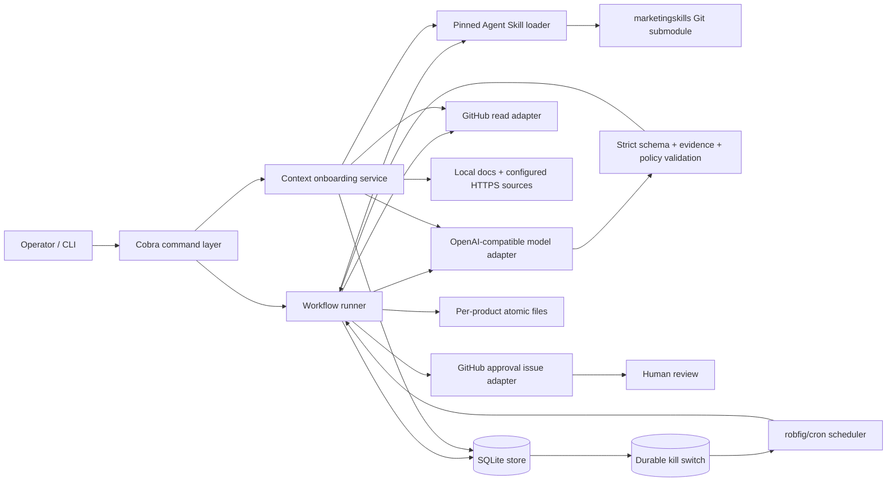
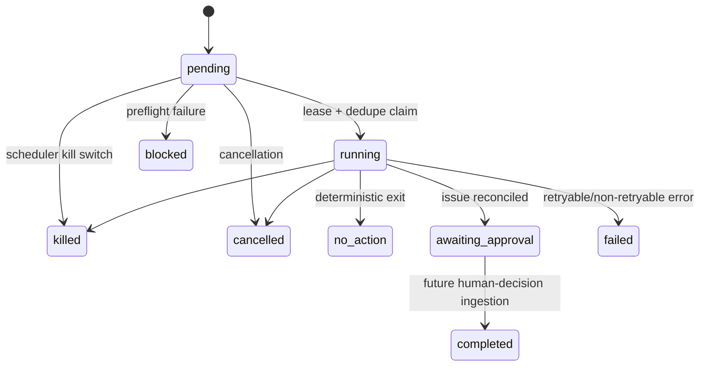

# Architecture

## Design principles

1. **Deterministic orchestration, bounded AI.** Go owns triggers, state transitions, retries, idempotency, validation, approvals, and side effects. The LLM receives a finite prompt and returns strict JSON.
2. **Evidence before generation.** Every factual output must cite immutable, same-product evidence IDs accepted by a deterministic validator.
3. **Human approval before execution.** The MVP can only stage a GitHub Issue. It has no publisher, sender, billing, or ad-platform adapter.
4. **Local-first state.** SQLite and per-product files are canonical operational stores. Remote writes are narrow and idempotently reconciled.
5. **Reproducible guidance.** Marketing skills are loaded from a pinned commit whose full repository manifest is verified before each AI workflow.
6. **Observable state machines.** Every claimed workflow has explicit status, attempt, lease, dedupe, cursor, error, model, cost, and audit metadata.

## Component model



### Boundaries

| Boundary | May do | Must not do |
|---|---|---|
| CLI/scheduler | Select product/workflow, invoke runner, stop on context cancellation | Reimplement workflow semantics |
| Workflow | Fetch evidence, call model, validate, persist transitions, stage approval | Publish/send/spend/approve |
| Model adapter | One structured completion with bounded retries/cost | Call tools or mutate state |
| GitHub adapter | Read repository/releases/files; find/create approval issue | Merge, release, push, label-delete, close, or publish marketing |
| Store | Transactions, leases, dedupe, cursors, audit | Contain model/business reasoning |
| Skill loader | Verify pin/manifest; load requested `SKILL.md` and explicit references | Auto-update or execute upstream scripts |

## Product onboarding flow

```mermaid
sequenceDiagram
  participant O as Operator
  participant C as CLI/Context service
  participant S as Source collectors
  participant K as Skill loader
  participant M as LLM
  participant DB as SQLite
  participant FS as Product workspace

  O->>C: product add
  C->>DB: product + disabled workflow definition
  C->>FS: initialize isolated workspace
  O->>C: context draft <product>
  C->>K: require pinned product-marketing skill
  C->>S: bounded source collection
  S-->>C: immutable evidence + source warnings
  C->>DB: evidence snapshots + skill version
  C->>M: redacted evidence + strict context schema
  M-->>C: markdown + evidence IDs + uncertainties
  C->>C: strict decode, heading/evidence validation, bounded repair
  C->>DB: unapproved context version
  C->>FS: .agents/product-marketing-context.draft.md
  O->>C: context approve <product> <version>
  C->>DB: supersede old canonical version; approve selected version
  C->>FS: .agents/product-marketing-context.md
```

Source collection is deliberately narrow: product metadata, common public repository docs (`README*`, `CHANGELOG.md`, selected docs indexes), configured website/docs/pricing/changelog pages, and GitHub README/changelog fallback. Local paths and symlinks must remain inside the configured repository root. Oversized responses are bounded.

## Release-to-marketing flow

```mermaid
sequenceDiagram
  participant T as Manual/cron trigger
  participant W as Release workflow
  participant DB as SQLite
  participant K as Skill loader
  participant G as GitHub
  participant M as LLM
  participant V as Validators
  participant FS as Product workspace

  T->>W: run(product, release?)
  W->>DB: require enabled definition + approved context
  W->>K: verify lock/manifest; load launch + support skills
  W->>G: resolve repository identity + published release
  W->>DB: claim dedupe key + workflow lease
  W->>DB: reconcile creating approval from prior crash
  W->>G: read optional tagged CHANGELOG.md
  W->>DB: persist immutable evidence
  W->>M: redacted context, evidence, pinned skills, JSON schema
  M-->>W: structured result
  W->>V: schema, evidence, channels, human gate, terminology, self-check
  alt no action / below threshold
    W->>DB: no_action + dedupe complete + cursor advance
  else marketable
    W->>DB: transactional approval intent + generated assets
    W->>FS: atomic approval and asset mirrors
    W->>G: find deterministic marker, then create issue if absent
    W->>DB: awaiting_approval + issue identity + dedupe complete + cursor advance
  end
```

### Why approval intent precedes the remote write

SQLite and GitHub cannot share a transaction. The workflow first commits a durable `creating` intent containing the complete issue request and deterministic hidden marker. After a crash or ambiguous HTTP failure, a retry searches GitHub for that marker. It creates an issue only if no match exists, then finalizes local state. This avoids both lost actions and duplicate approval issues.

## Run state machine



The current version creates and records `awaiting_approval`; it deliberately does not interpret comments or execute an approved action.

## Concurrency and reliability

- SQLite uses WAL mode, foreign keys, a busy timeout, and serializable transactions where claims/finalization matter.
- A unique active workflow claim prevents overlap per product/workflow.
- Fencing tokens prevent a stale worker from finalizing after lease replacement.
- Dedupe keys are stable hashes of product ID, workflow ID, immutable GitHub repository ID, and release ID.
- Dedupe completion and cursor advancement occur only in the same successful finalization transaction.
- Failed runs release the active claim but do not complete dedupe or advance the cursor.
- The scheduler reconciles enabled definitions while running, checks the global kill switch before each attempt/retry, applies per-workflow timeouts, and shuts down on context cancellation.

## Package layout

```text
cmd/marketing-os/       executable and signal handling
internal/app/           CLI and dependency wiring
internal/config/        strict YAML configuration
internal/domain/        products, contexts, workflows, states
internal/state/         SQLite migrations and transactional repository
internal/skills/        pinned Agent Skill parser/manifest/update
internal/productcontext onboarding source collection and context drafting
internal/llm/           provider abstraction, retries, cost, redaction
internal/skillruntime/  prompt assembly, schemas, deterministic validation
internal/github/        narrow GitHub REST adapter
internal/approvals/     issue rendering and idempotency markers
internal/workflows/     release workflow state machine
internal/scheduler/     cron reconciliation, retry, kill switch
internal/products/      isolated atomic workspace writes
migrations/             embedded ordered SQL migrations
```

## Assumptions and explicit choices

- GitHub Releases are the first durable business event; polling is used instead of webhooks to keep deployment local-first.
- GitHub Issues are the first human approval interface because they provide identity, comments, auditability, and URLs without adding a web frontend.
- The model endpoint must support OpenAI-compatible strict `json_schema` responses.
- Pricing is operator-configured. A zero token price records usage but estimates cost as zero; hard per-run token/output bounds still apply.
- PostgreSQL is a future deployment option. Domain/services do not rely on SQLite types, while SQL/migrations remain isolated in `internal/state` for a future dialect implementation.
