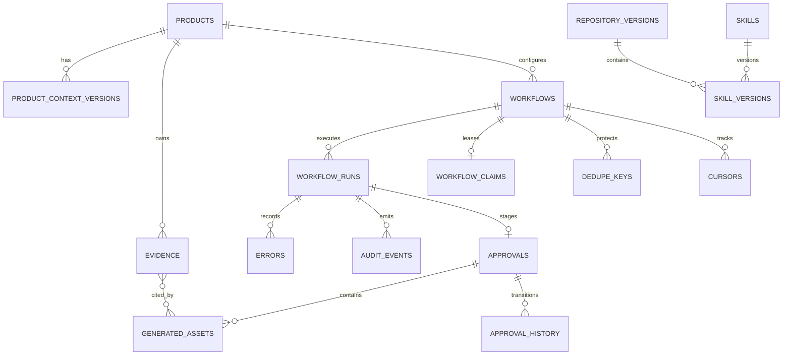

# Database design

Marketing OS uses SQLite as its first durable state store. Migrations are embedded in the Go binary and applied transactionally at startup. The connection enables foreign keys, WAL mode, a busy timeout, and bounded connection counts suitable for a single local scheduler plus manual commands.

## Logical schema



## Tables

| Table | Purpose | Important invariants |
|---|---|---|
| `products` | Product registry and source endpoints | Stable lowercase product ID; no credentials |
| `product_context_versions` | Immutable context drafts/approvals | Monotonic version; one approved version per product via partial unique index |
| `evidence` | Immutable source snapshots | Product-scoped ID; content SHA-256; source/external identity |
| `repository_versions` | Installed marketing-skills repository snapshots | Commit SHA primary key and full-manifest hash |
| `skills` | Current indexed skill metadata | Name primary key |
| `skill_versions` | Skill/repository audit history | `(skill_name, version, repository_commit)` unique |
| `workflows` | Complete deterministic definitions | Required inputs/steps/check/state/dedupe/stop/error/output/approval/cost/timeout fields |
| `workflow_runs` | Attempt and result observability | Explicit state enum; model, tokens, cost, evidence, skill/context versions |
| `workflow_claims` | One active lease per product/workflow | Fencing token and lease expiration |
| `dedupe_keys` | Event-level idempotency lifecycle | Unique `(product, workflow, dedupe_key)`; completion only on success |
| `approvals` | Durable remote-write intent and reconciled issue | Unique run/dedupe/marker/request hash; `creating` before HTTP write |
| `generated_assets` | Channel-specific proposed drafts | Content hash; evidence ID JSON; never auto-executed |
| `approval_history` | Append-only approval transitions | Actor, external event ID, note, timestamp |
| `cursors` | Last successfully processed source position | Advances in finalization transaction only |
| `errors` | Structured run failures | Retryability and timestamp |
| `audit_events` | Append-only state-change records | Product/workflow/run linkage and JSON data |
| `scheduler_state` | Durable global kill switch | Singleton row survives restarts |
| `schema_migrations` | Applied embedded migration versions | Managed by the store bootstrap |

## Claim and dedupe transaction

For a non-dry run, `ClaimWorkflow` executes one transaction:

1. Validate product/workflow and current definition.
2. Reject a completed dedupe key as a duplicate.
3. Reject an unexpired active claim when overlap is disabled.
4. Replace an expired claim with an incremented fencing token.
5. Insert/reopen the dedupe key as `processing`.
6. Insert a `running` workflow run and audit event.
7. Commit.

Every finalizer compares the run’s fencing token to the active claim. A stale worker cannot complete dedupe, move a cursor, or finalize an approval.

## Successful finalization

`no_action` and `awaiting_approval` finalizers atomically:

- update run status and metadata;
- mark the dedupe key complete;
- advance the source cursor;
- delete the active claim using its fencing token;
- append an audit event.

Failure finalization records the error and releases the claim, but deliberately leaves dedupe incomplete and the cursor unchanged so a later attempt can recover.

## Approval write-ahead state

The `approvals` row stores:

- deterministic approval ID and hidden issue marker;
- exact title/body and request hash;
- evidence summary, proposed action, risks, warnings, cost;
- target GitHub repository;
- remote issue identity once reconciled.

Generated assets and the `creating` approval history entry are inserted in the same transaction. Remote GitHub creation happens only afterward.

## Context versioning

Draft creation assigns `MAX(version)+1` within a transaction. Approval changes the selected draft to `approved` and any previous approved version to `superseded`. The partial unique index is a database-level guarantee that only one approved context exists per product.

## PostgreSQL migration path

SQLite-specific connection setup and SQL live behind `internal/state`. A future PostgreSQL store should preserve domain/service interfaces and reproduce these invariants with:

- PostgreSQL migrations and `TIMESTAMPTZ`;
- `INSERT ... ON CONFLICT` equivalents (already conceptually aligned);
- `SELECT ... FOR UPDATE SKIP LOCKED` or advisory locks for claims;
- transaction isolation tests matching the SQLite concurrency suite;
- the same dedupe, fencing, cursor, approval-intent, and audit semantics.

Do not migrate by replacing SQLite calls ad hoc in workflow code. Add a store interface at the service boundary and run the same contract tests against both implementations.

## Backup and inspection

Stop the scheduler or use SQLite’s online backup mechanism before copying an active database. For routine inspection, prefer the CLI:

```sh
marketing-os runs list --json
marketing-os runs show <run-id> --json
marketing-os approvals list --json
marketing-os approvals show <approval-id> --json
```

Runtime files are secondary mirrors; SQLite remains the operational source of truth.
